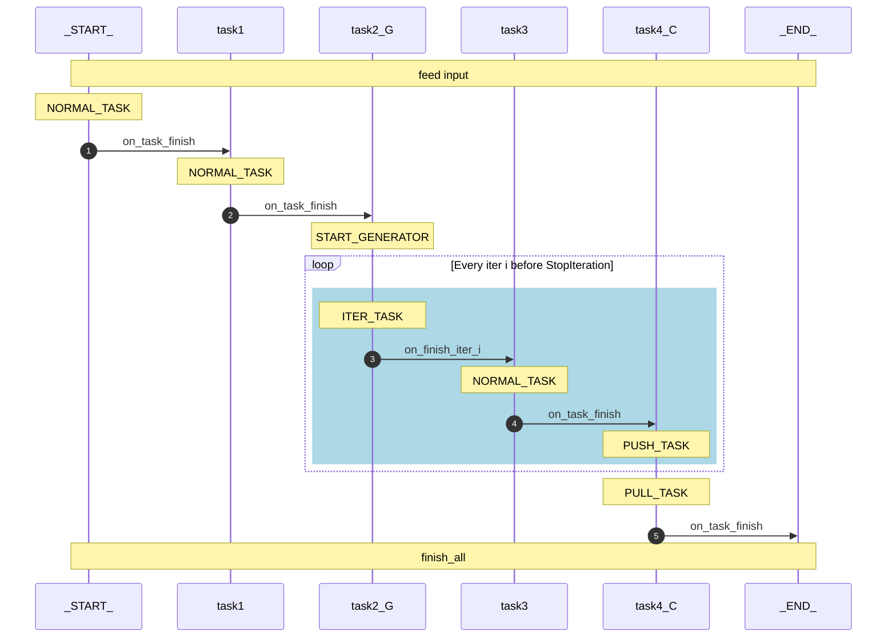

# task scheduler

## Features

* dependence check, change detection continuous development
* Inheritance of task configuration, and code from parent tasks
  * The run function is defined in the last parent
  * The nearest parameter overrides the parent

TODO:

* [x] Add task type: generator
* [x] Add parameter type: collector
* [x] Multi-process
* [x] Dirty check, rerun dirty tasks
* [x] Resume on restart
* [ ] cluster support
* [ ] init signal to interrupt the task
* [ ] file watcher

generator design:

generator and collector should be defined explicitly in the config header.

* The on_start of a generator with CallBackEvent.iter == None should start
  a new generator, it will set the CallBackEvent.iter to 0 and call on_iter of itself.
* the on_iter function of child tasks should be called when the generator generates a new
  value.

behaviors of tasks depend on a generator:

* normal task: the mod.run will be called when the generator generates a new value,
  the task can only accept a single generator as input, mod may be deleted before the
  next call
* generator task: the mod.run will be called when the generator generates a new value,
  the mod will be persisted until all iters are over,
  * if the mod.run yields multiple values, the child tasks will be executed for each
      value
  * if stop iteration is generated by root, it will be passed to all child tasks, child
      task will determine whether to stop the iteration or not
* Collector task: the mod.run will be called when the generator generates a new value,
  * the mod will be persisted until all iters are over,
  * if stop iteration is generated by root, a Finish event will be generated, and the
      mod.gether function is called.

